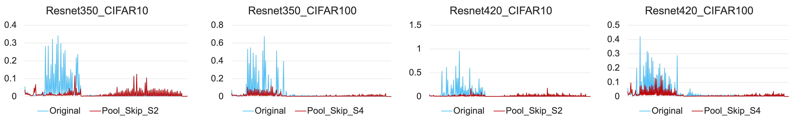

# Beyond Skip Connection: Pooling and Unpooling Design for Elimination Singularities (AAAI 25)

**Authors**: Chengkun Sun, Jinqian Pan, Zhuoli Jin, Russell Stevens Terry, Jiang Bian, Jie Xu

**Paper**: [AAAI Library Link](https://ojs.aaai.org/index.php/AAAI/article/view/34278)

### Quick Integration

To use our `PoolSkip` module directly, you can download [`pool_skip.py`](./pool_skip.py) and plug it into your architecture.  

To integrate PoolSkip, simply insert it after the convolutional layer, but before the activation function and batch normalization layer.
While effective with other convolution kernel sizes, the performance is best when applied after a 1x1 convolution.

<div align="center">  </div> <p align="left"> <small><i>Figure: $\frac{l_{2}}{l_{1}}$ value quantitative comparison in ResNet350 and ResNet420 on CIFAR10 and CIFAR100 Datasets. The $\frac{l_{2}}{l_{1}}$ values were computed based on the output sequence of the network, with and without the incorporation of the Pool Skip. The plot highlights a moderate alleviation of the network degradation issue in shallow layers upon the integration of Pool Skip. Note: The horizontal axis represents the layers of the network along the output direction, from left to right. The “Pool Skip S4” means
the size of Pool operation kernel is 4, “Pool Skip S4” does 2.</i><small> </p>

### Effect on ResNet

This structure is particularly effective for addressing elimination singularity in convolutional neural networks. After applying PoolSkip, we observed a significant reduction in the number of shallow-layer 0 weights on ResNet architectures, improving model robustness and feature learning.


### Pytorch-cifar100

practice on cifar100 using pytorch

#### Requirements

This is my experiment eviroument
- python3.6
- pytorch1.6.0+cu101


#### 1. enter directory
```bash
$ cd pytorch-cifar100
```

#### 2. dataset
I will use cifar100 dataset from torchvision since it's more convenient, but I also
kept the sample code for writing your own dataset module in dataset folder, as an
example for people don't know how to write it.

#### 3. train the model
You need to specify the net you want to train using arg -net

```bash
# use gpu to train vgg16
$ python train.py -net vgg16 -gpu
```
### Acknowledgements
This project was based on (https://github.com/weiaicunzai/pytorch-cifar100).
Special thanks to the contributors for making development easier.  


